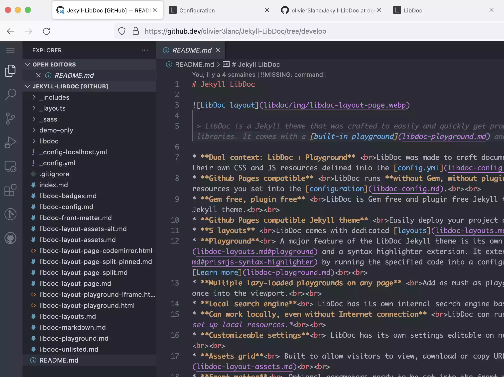

* 
{:toc}

## Requirements

LibDoc requires only [Jekyll](https://jekyllrb.com/) to compile your work.

## Locally

1. Install Jekyll on your machine following the steps described [here](https://jekyllrb.com/docs/)
2. Get the latest version of LibDoc 
    * [Download blank](https://github.com/olivier3lanc/Jekyll-LibDoc/archive/refs/heads/master.zip) or [Download with demo content](https://github.com/olivier3lanc/Jekyll-LibDoc/archive/refs/heads/develop.zip)
    * You can also clone repository `git@github.com:olivier3lanc/Jekyll-LibDoc.git`
3. Into the folder where LibDoc was copied, adjust your settings of your YAML file, Most important are
    * `url`  The host of your local set up, this can be for example *http://localhost* or *http://192.168.1.2* or domaine name
    * `baseurl`  The path to your local copy of LibDoc. For example */Jekyll-LibDoc/_site*
    * `title`  Title of the documentation
    * `description`  Description of your documentation project
4. Compile your project using:
    * `jekyll build`  Builds the project using *_config.yml*
    * `jekyll build -c _personal-config.yml`   Builds the project using *_personal-config.yml*
    * `jekyll build -c _personal-config.yml --watch`   Builds the project using *_personal-config.yml* and automatically compiles on detected changes.
    * Learn more about command line usage on [official Jekyll documentation](https://jekyllrb.com/docs/usage/)

## Online

It is possible to craft documentation with LibDoc only with your browser, [Github](https://www.github.com) and [Github Pages](https://pages.github.com).

1. Copy or fork [LibDoc repository](https://github.com/olivier3lanc/Jekyll-LibDoc)
2. On the forked/copy repository, press `Shift + .` or go to `https://github.dev/[GH_USER_NAME]/[REPO_NAME]/tree/[BRANCH_NAME]`
3. You are now into [Visual Studio Code](https://code.visualstudio.com/) and you can edit, commit and push.

## Enable Github Pages

To automatically compile your LibDoc project, just enable your instance on this page `https://github.com/[GH_USER_NAME]/[REPO_NAME]/settings/pages`. [Learn more](https://pages.github.com/)

Each time you commit and push on the specified branch, [Github Pages](https://pages.github.com) builds and hosts your project on the URL `https://[GH_USER_NAME].github.io/[REPO_NAME]`.

